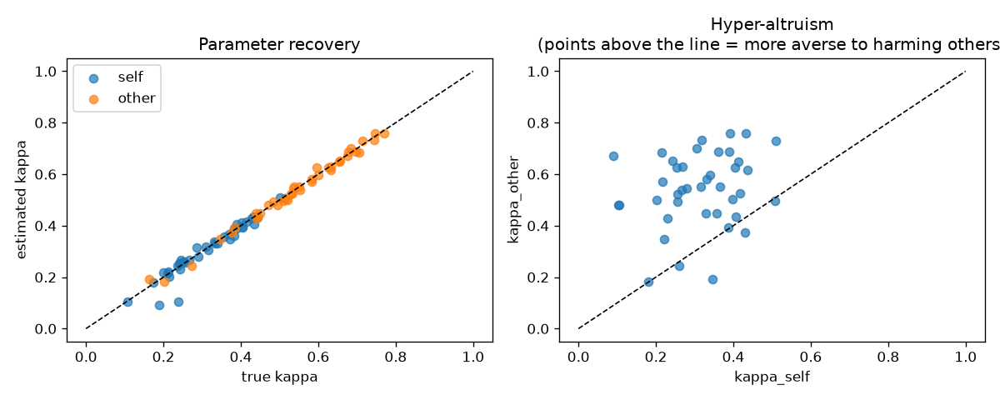
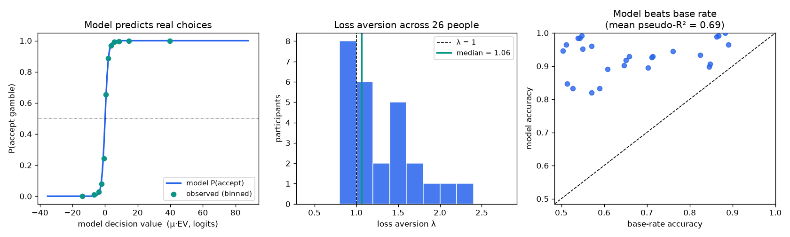
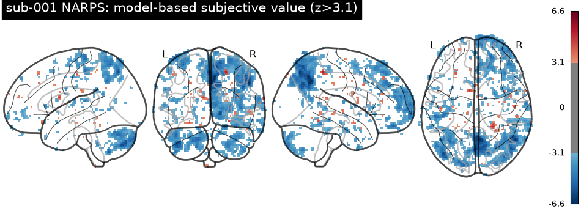

# Hands-on: Value-Based Modeling from Harm Aversion to fMRI

**A short, self-contained tutorial for undergraduates.** By the end you will have
(1) built and fit a harm-aversion model for moral decision-making, and
(2) transferred the same value-modeling logic to a real, openly available NARPS
loss-aversion dataset for behavioral modeling and model-based fMRI.

> **Time:** ~2–3 hours · **Coding level:** beginner Python (loops, functions, numpy) ·
> **Math level:** you should be comfortable seeing an equation; we explain every symbol.

---

## What you'll learn

1. **What a computational model of behavior actually is** — and why social
   neuroscientists love them.
2. **The harm-aversion model** (Crockett and colleagues): how to express "I won't
   hurt someone for money" as an equation with one interpretable parameter.
3. **Maximum-likelihood fitting** — how to recover a person's hidden parameters
   from their choices, and how to check that your fitting works (*parameter
   recovery*).
4. **The bridge to the brain (model-based fMRI):** how the *trial-by-trial
   subjective value* predicted by your model becomes a regressor in a brain
   analysis, revealing where the brain encodes value.
5. **A real analysis on real data** — the open **NARPS** dataset (108 people
   making mixed-gamble decisions in an MRI scanner; this tutorial can run one
   subject/run, and the included behavioral showcase used 26 participants).

You'll find runnable code in [`code/`](code/):

| File | What it does | Needs |
| --- | --- | --- |
| [`code/harm_aversion_model.py`](code/harm_aversion_model.py) | Part 1: simulate + fit harm aversion (method) | numpy, scipy |
| [`code/narps_behavioral_modeling.py`](code/narps_behavioral_modeling.py) | Part 2: behavioral-modeling showcase on **real** NARPS choices | + pandas |
| [`code/model_based_fmri_narps.py`](code/model_based_fmri_narps.py) | Parts 2–3: fit real choices + model-based fMRI | + nilearn, openneuro-py |

> **Real vs. simulated data, up front.** Part 1 fits the harm-aversion model to
> *simulated* choices — the model and the fitting are real, but the data are
> synthetic, because Crockett's harm-aversion dataset is available only on request.
> Part 2 then runs the **same value-modeling machinery on real, openly
> downloadable data** (the NARPS mixed-gambles task). The real-data parameter is
> loss aversion (`λ`), not harm aversion (`κ`).

---

## Setup

From the repository root:

```bash
python3 -m venv venv && source venv/bin/activate
pip install -r tutorials/harm-aversion-fmri/requirements.txt
```

Part 1 needs only **numpy**, **scipy**, and **matplotlib**, so you can begin
immediately. Install **nilearn** and **openneuro-py** when you reach Part 3.

---

## Background: the science of harm aversion

Most people will *not* hurt another person, even for money. But *how much* do we
value not-harming? Is avoiding harm to a stranger worth more or less to us than
avoiding harm to ourselves?

[Molly Crockett and colleagues](https://www.pnas.org/doi/10.1073/pnas.1408988111)
turned this moral question into a measurable one. Participants (the "deciders")
made a series of choices, each between two options that traded off **money**
against **painful electric shocks**. Crucially, the shocks went either to the
decider (the **Self** condition) or to an anonymous stranger (the **Other**
condition) — but the decider always kept the money in both.

By modeling these choices, the researchers could read out, for each person, an
**exchange rate between money and pain** — separately for harming self and
harming others. The striking finding: most people demanded *more* money to harm a
stranger than to harm themselves. Crockett called this **"hyper-altruism."** A
[2017 fMRI study](https://www.nature.com/articles/nn.4557) then showed that
model-derived values were tracked by the brain's valuation network, and that
this signal was *blunted* for ill-gotten gains.

> The original fMRI data are available from the authors on request, so in Part 3
> we use a **fully open** dataset that uses the very same modeling logic. This is
> itself a lesson in open science — and exactly the problem the
> [dataset directory](../../) this tutorial ships with is meant to solve. The two
> datasets used here are catalogued as
> [Harm Aversion (Crockett)](../../data/datasets/crockett-harm-aversion.json) and
> [NARPS](../../data/datasets/narps-mixed-gambles.json).

---

## Part 1 — A computational model of harm aversion

### 1.1 The model in words

On each trial the decider chooses between:

- the **MORE** option: **more money**, but **more shocks**, and
- the **LESS** option: **less money**, but **fewer shocks**.

Write `Δm` for the *extra money* and `Δs` for the *extra shocks* that the MORE
option carries. The **subjective value** of taking that money-for-shocks deal is

```
ΔV = (1 − κ)·Δm  −  κ·Δs
```

`κ` (Greek "kappa") is the **harm-aversion parameter**, between 0 and 1:

- `κ → 0`: "only the money matters" — the person barely weighs the shocks.
- `κ → 1`: "only the harm matters" — the person won't shock for any amount of money.

People don't choose perfectly, so we turn value into a *probability* of choosing
the MORE option with a **logistic (softmax)** function:

```
P(choose MORE) = 1 / (1 + exp(−γ·ΔV))
```

`γ` ("gamma") is the **inverse temperature**: large `γ` → sharp, near-deterministic
choices; small `γ` → noisy choices. This `value → softmax → choice` pattern is the
single most common building block in computational social neuroscience.

### 1.2 Simulate a participant

We *generate* choices from the model so we know the ground truth. (Full code in
[`code/harm_aversion_model.py`](code/harm_aversion_model.py).)

```python
import numpy as np
from scipy.special import expit            # stable logistic: 1/(1+exp(-x))

def choice_prob(kappa, gamma, delta_m, delta_s):
    delta_v = (1 - kappa) * delta_m - kappa * delta_s
    return expit(gamma * delta_v)

rng = np.random.default_rng(0)
n = 200
delta_m = rng.integers(1, 11, n).astype(float)   # extra money,  1..10
delta_s = rng.integers(1, 11, n).astype(float)   # extra shocks, 1..10

true_kappa, true_gamma = 0.6, 3.0
p = choice_prob(true_kappa, true_gamma, delta_m, delta_s)
choices = (rng.random(n) < p).astype(int)        # 1 = chose MORE (money+shocks)
```

Varying the money/shock trade-off across trials is what makes `κ` *identifiable*:
you can't measure how someone trades off two things if you never change the
trade-off.

### 1.3 Fit the model (maximum likelihood)

Fitting means finding the `(κ, γ)` that make the observed choices **least
surprising**. We minimize the *negative log-likelihood*:

```python
from scipy.optimize import minimize

def neg_log_lik(params, delta_m, delta_s, choices):
    kappa, gamma = params
    p = np.clip(choice_prob(kappa, gamma, delta_m, delta_s), 1e-9, 1 - 1e-9)
    return -np.sum(choices*np.log(p) + (1-choices)*np.log(1-p))

res = minimize(neg_log_lik, x0=[0.5, 1.0],
               args=(delta_m, delta_s, choices),
               method="L-BFGS-B", bounds=[(1e-3, 1-1e-3), (1e-3, 50)])
kappa_hat, gamma_hat = res.x
```

### 1.4 The whole experiment + the result

`harm_aversion_model.py` simulates **40 participants** whose *true* `κ_other`
tends to be larger than their `κ_self`, then recovers everyone's parameters and
tests the hyper-altruism effect. Run it:

```bash
python tutorials/harm-aversion-fmri/code/harm_aversion_model.py
```

You should see something close to:

```
Parameter recovery (correlation true vs. estimated kappa):
  Self : r = 0.96
  Other: r = 1.00

Estimated harm aversion (mean +/- SD):
  kappa_self  = 0.31 +/- 0.10
  kappa_other = 0.54 +/- 0.14

Hyper-altruism (kappa_other - kappa_self) = 0.23
Paired t-test: t = 9.02, p = 4.3e-11
Fraction of participants with kappa_other > kappa_self: 90%
```

and a figure, `tutorials/harm-aversion-fmri/results/harm_aversion_results.png`:



**How to read it.** *Left:* estimated `κ` sits right on the diagonal versus the
true `κ` — our fitting procedure works (good *parameter recovery*; always check
this before trusting a model on real data). *Right:* almost every participant lies
**above** the diagonal, i.e. `κ_other > κ_self` — they are more averse to harming
others than themselves. That is hyper-altruism, recovered from nothing but
choices.

> **Exercises.**
> 1. Lower `γ` (noisier choosers). What happens to parameter recovery? Why?
> 2. Make `n` (trials) smaller, e.g. 40. How does estimate variability change?
> 3. Add a *random-choice* model (`P = 0.5`) and compare fits with the
>    [BIC](https://en.wikipedia.org/wiki/Bayesian_information_criterion). Does the
>    harm-aversion model win?

---

## Part 2 — The same idea on a real, open dataset

The harm-aversion model is one instance of a **value-based decision** model. The
identical machinery describes **loss aversion**: people weigh potential *losses*
more than equal *gains*. We now switch to **NARPS**
([OpenNeuro ds001734](https://openneuro.org/datasets/ds001734)), where **108
participants** decided whether to accept 50/50 gambles of a possible **gain** vs.
a possible **loss**, *in an MRI scanner*. Everything is open and BIDS-formatted.

The value of accepting a gamble is

```
EV = 0.5·gain − 0.5·λ·loss
```

`λ` ("lambda") is **loss aversion**: `λ > 1` means losses loom larger than gains.
Same softmax choice rule as before — `P(accept) = logistic(μ·EV)` — so you reuse
the Part 1 fitting code almost verbatim.

For behavioral fitting, download one participant's event files:

```bash
pip install openneuro-py
python3 -m openneuro download --dataset ds001734 --target-dir ds001734 \
  --include 'sub-001/func/sub-001_task-MGT_*_events.tsv'
```

The `events.tsv` files are tiny, so you can fit behavior even without the imaging:

```bash
NARPS_DIR=ds001734 python -c "import sys; sys.path.insert(0, 'tutorials/harm-aversion-fmri/code'); import model_based_fmri_narps as m; m.stage_a('sub-001')"
```

`stage_a` reads the real choices, fits `(λ, μ)`, and prints the participant's loss
aversion. (See `load_events`, `fit_loss_aversion` in
[`code/model_based_fmri_narps.py`](code/model_based_fmri_narps.py).)

### Behavioral modeling on real data — the showcase (we executed this)

Part 1 *simulated* harm aversion to teach the method, because Crockett's data is
request-only. Here the **same model is fit to real choices**.
[`code/narps_behavioral_modeling.py`](code/narps_behavioral_modeling.py) runs the
whole workflow — fit each person, check the fit, compare models — and was executed
for this tutorial on **26 NARPS participants**:

```
loss aversion lambda : median 1.06, mean 1.30, 69% with lambda>1
model accuracy       : 92.8%  (base rate 67.1%)
McFadden pseudo-R^2  : 0.692
free-lambda beats lambda=1 (delta BIC>0) for 62% of participants
```



**How to read it.** *Left:* the model's predicted accept-probability curve (line)
lands right on the **observed** choice proportions (points) — the model genuinely
captures behavior, predicting real choices at **92.8% accuracy** (vs. a 67% base
rate) with a pseudo-R² of 0.69. *Middle:* loss aversion λ across people — most are
loss-averse (λ > 1), with the heterogeneous spread the literature reports. *Right:*
every participant sits above the diagonal, so the model beats the base-rate baseline
for everyone; letting λ vary (vs. forcing λ = 1) improves fit for 62% of people.

This is the real behavioral-modeling result. The fitted λ per participant is exactly
what we carry into the fMRI analysis next.

---

## Part 3 — Model-based fMRI: where does the brain track value?

Now the payoff. We use the model's **trial-by-trial subjective value** as a
**parametric modulator** in a first-level GLM. Intuition: build a predicted brain
time-course that goes *up on high-value trials and down on low-value trials*,
convolve it with the hemodynamic response, and ask **which voxels follow it**.

`build_modulated_events` creates **three** regressors per run:

- `decision` — a constant "a gamble was on screen" event,
- `gain` — modulated by each trial's (mean-centered) gain,
- `loss` — modulated by each trial's (mean-centered) loss.

Why not a fourth `value` regressor? Because subjective value
`EV = 0.5·gain − 0.5·λ·loss` is an *exact linear combination* of gain and loss —
adding it would make the design rank-deficient (collinear). Instead we form the
**model-based value map as a λ-weighted contrast** of the two regressors. This is
the elegant part: **your fitted λ enters the brain analysis through the contrast
weights.**

```python
import numpy as np
from nilearn.glm.first_level import FirstLevelModel

glm = FirstLevelModel(t_r=1.0, hrf_model="spm", smoothing_fwhm=5.0,
                      high_pass=1/128, mask_img=mask)
glm.fit(bold_img, events=design_events, confounds=motion_confounds)

# value = 0.5*gain - 0.5*lambda*loss, built over the fitted design columns
cols = glm.design_matrices_[0].columns.tolist()
w = np.zeros(len(cols))
w[cols.index("gain")] =  0.5
w[cols.index("loss")] = -0.5 * lam            # lam = the loss aversion you fit
value_zmap = glm.compute_contrast(w,            output_type="z_score")
gain_zmap  = glm.compute_contrast("gain",       output_type="z_score")
```

For the one-run GLM, also download the fMRIPrep files for `sub-001`, run 1. This
is the large part of the tutorial; the preprocessed BOLD file is roughly 1 GB.

```bash
python3 -m openneuro download --dataset ds001734 --target-dir ds001734 \
  --include 'sub-001/func/sub-001_task-MGT_run-01_events.tsv' \
  --include 'derivatives/fmriprep/sub-001/func/sub-001_task-MGT_run-01_bold_space-MNI152NLin2009cAsym_preproc.nii.gz' \
  --include 'derivatives/fmriprep/sub-001/func/sub-001_task-MGT_run-01_bold_space-MNI152NLin2009cAsym_brainmask.nii.gz' \
  --include 'derivatives/fmriprep/sub-001/func/sub-001_task-MGT_run-01_bold_confounds.tsv'
```

Run the full pipeline for one participant/run:

```bash
NARPS_DIR=ds001734 python tutorials/harm-aversion-fmri/code/model_based_fmri_narps.py
```

It saves `sub-001_run-01_value_zmap.nii.gz` (plus `gain` and `loss`) and a
thresholded brain figure for each in `tutorials/harm-aversion-fmri/results/`.

### What you should find

The classic value signal for accepting monetary gambles shows up in the
**ventromedial prefrontal cortex (vmPFC)** and **ventral striatum** — they track
`value` and `gain` *positively*. Regions tracking the looming `loss` (and the
loss-aversion asymmetry) include parts of the striatum and, in some analyses, the
amygdala and insula. This is the same valuation network that, in Crockett's
harm-aversion study, encoded the (de)valued outcomes of moral choices — which is
why model-based fMRI is such a powerful tool for **social** neuroscience: it lets
us localize abstract, subjective quantities like *the value of not harming
someone*.

### What we actually got (executed on sub-001, run 1)

We ran exactly this pipeline on real data. The GLM produced robust effects — the
model-based **value** contrast peaked at **z = 5.2** with **~8,000 voxels at
z > 3.1** (gain: peak z 4.7; loss: peak z 6.2). Here is the value map as a
glass-brain projection:



A single subject and a single run is *noisy* — you see widespread clusters rather
than a clean vmPFC blob, which is exactly why the caution below matters. The point
of this tutorial is the **method**: you fit a behavioral model and used its
parameter to build a brain map. Averaging the four runs, and then many subjects at
the group level, is what turns this into the textbook vmPFC/striatum value signal.

> **A caution about NARPS.** This dataset is famous because
> [70 teams analyzed it and reached different conclusions](https://www.nature.com/articles/s41586-020-2314-9).
> Treat your single-subject map as a teaching artifact, not a discovery. Real
> inference needs the whole group, careful preprocessing, and multiple-comparison
> correction.

---

## Putting it together

You took a *moral question* ("would you hurt someone for money?"), turned it into
an **equation with one interpretable parameter**, **recovered** that parameter
from choices, validated your method, and then used the model to **interrogate the
brain** on real open data. That two-step — *fit a model of behavior, then use the
model to analyze the brain* — is the engine behind much of modern computational
social neuroscience.

### Where to go next

- **Swap in another dataset.** Browse the directory for value/decision/emotion
  datasets — e.g. [UCLA CNP](../../data/datasets/ucla-cnp.json) (emotional-face
  task) or naturalistic, socially-rich movies like
  [The Grand Budapest Hotel](../../data/datasets/grand-budapest-hotel-fmri.json).
- **Add another model.** Implement a model where `gain` and `loss` have separate
  sensitivities and compare it to the loss-aversion model with BIC.
- **Go to the group level.** Fit `stage_b` for several participants and run a
  nilearn `SecondLevelModel` across their `value` maps.

---

## References

- Crockett MJ, Kurth-Nelson Z, Siegel JZ, Dayan P, Dolan RJ (2014).
  *Harm to others outweighs harm to self in moral decision making.* PNAS, 111(48),
  17320–17325. <https://www.pnas.org/doi/10.1073/pnas.1408988111>
- Crockett MJ, Siegel JZ, Kurth-Nelson Z, Dayan P, Dolan RJ (2017).
  *Moral transgressions corrupt neural representations of value.* Nature
  Neuroscience, 20(6), 879–885. <https://www.nature.com/articles/nn.4557>
- Botvinik-Nezer R, et al. (2019). *fMRI data of mixed gambles from the
  Neuroimaging Analysis Replication and Prediction Study.* Scientific Data, 6, 106.
  <https://openneuro.org/datasets/ds001734>
- Botvinik-Nezer R, et al. (2020). *Variability in the analysis of a single
  neuroimaging dataset by many teams.* Nature, 582, 84–88.
  <https://www.nature.com/articles/s41586-020-2314-9>
- Tom SM, Fox CR, Trepel C, Poldrack RA (2007). *The neural basis of loss aversion
  in decision-making under risk.* Science, 315(5811), 515–518.
- nilearn — *Machine learning for neuroimaging in Python.*
  <https://nilearn.github.io/>

---

*Part of [Social Neuroscience DataFinder](../../). Found an error or have an
improvement? Contributions welcome.*
