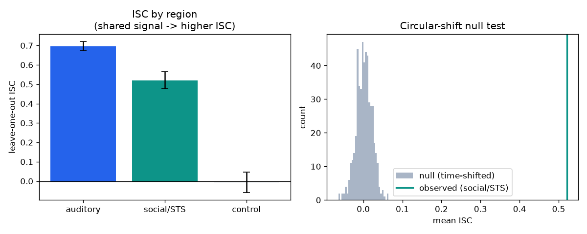
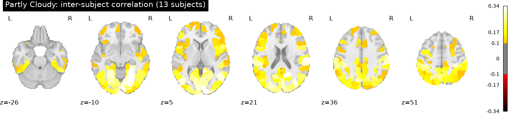
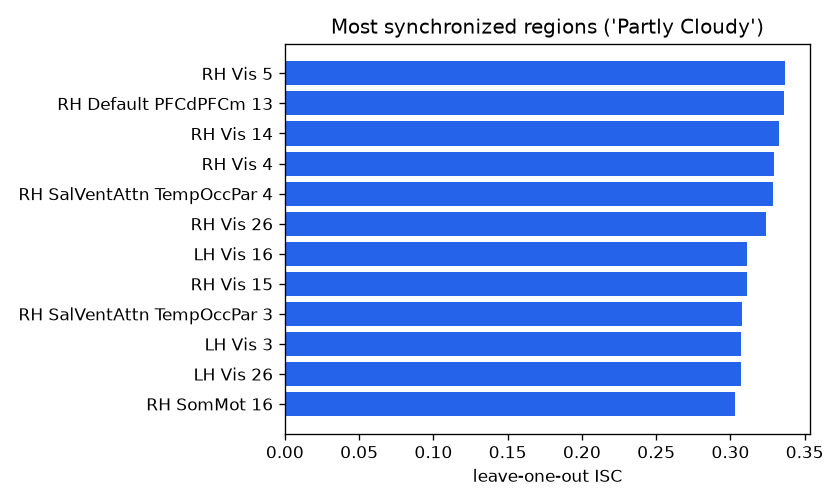

# Hands-on: Inter-Subject Correlation on a Naturalistic Movie

**A short, self-contained tutorial for undergraduates.** When people watch the
same movie, their brains respond in similar, time-locked ways. You'll measure
that shared response — **inter-subject correlation (ISC)** — first on simulated
data (so you can see it recover ground truth), then on a **real, openly available
movie-fMRI dataset**: *Partly Cloudy*, a theory-of-mind short film.

> **Time:** ~2 hours · **Coding level:** beginner Python · **Math level:** you
> should be comfortable with the idea of a correlation.

---

## What you'll learn

1. **Why naturalistic stimuli** (movies, stories) are powerful for studying the
   *social* brain — and what you can't do with them.
2. **Inter-subject correlation (ISC)** and the standard **leave-one-out** estimator.
3. How to tell a real ISC from noise with a **circular-shift permutation test**.
4. How to run ISC on real fMRI with **nilearn**: parcellate the brain with an
   atlas, extract region time series, and map where brains synchronize.
5. How to interpret high-ISC regions — sensory cortex *and* the social brain
   (STS, TPJ, medial prefrontal cortex).

Runnable code is in [`code/`](code/):

| File | What it does | Needs |
| --- | --- | --- |
| [`code/isc_demo.py`](code/isc_demo.py) | Part 1: ISC mechanics + null test on simulated data | numpy, scipy |
| [`code/isc_partly_cloudy.py`](code/isc_partly_cloudy.py) | Part 2: ISC on **real** movie fMRI (nilearn fetches it) | + nilearn |
| [`code/isc_naturalistic.py`](code/isc_naturalistic.py) | Variant: ISC on Grand Budapest once derivatives are available locally | + nilearn, openneuro-py |

---

## Setup

From the repository root:

```bash
python3 -m venv venv && source venv/bin/activate
pip install -r tutorials/naturalistic-isc/requirements.txt
```

Part 1 needs only **numpy**, **scipy**, **matplotlib** — start now. Add
**nilearn** (≥0.10, with **matplotlib ≥ 3.8**) for the real-data Part 2.

---

## Background: naturalistic neuroscience and the social brain

Classic experiments show the same isolated stimulus (a face, a word) over and
over. But social life isn't isolated trials — it's continuous, unfolding,
context-rich. **Naturalistic neuroscience** instead shows participants *movies*
or *stories* and asks what their brains do with the rich social stream.

The foundational analysis is **inter-subject correlation** (Hasson et al., 2004):
if a brain region is reliably driven by the shared stimulus, then *different
people's* time courses in that region should look alike. ISC turns "is this
region tracking the movie?" into "do subjects agree?", with no need to model the
stimulus explicitly — perfect for messy naturalistic input. In this tutorial,
the executable real-data path uses
[Partly Cloudy](../../data/datasets/richardson-partly-cloudy.json), a Pixar
short designed to engage theory of mind and pain-network reasoning. It sits in
the [directory](../../) alongside other naturalistic options you could swap in:
Grand Budapest Hotel, Sherlock, CNeuroMod, and Narratives.

---

## Part 1 — ISC mechanics (runs instantly on simulated data)

### 1.1 The idea

Model each subject's time series in a region as a mix of a **shared**,
stimulus-locked signal `s(t)` and **private** noise `e_i(t)`:

```
x_i(t) = √c · s(t)  +  √(1−c) · e_i(t)
```

`c` ∈ [0, 1] is the fraction of the signal that is *shared* across people. Larger
`c` → higher ISC. We simulate three regions:

| Region | shared `c` | meaning |
| --- | --- | --- |
| auditory | 0.50 | strongly stimulus-locked |
| social/STS | 0.30 | socially driven, moderately shared |
| control | 0.00 | private / not stimulus-locked (a clean null) |

### 1.2 Leave-one-out ISC

The standard estimator (Nastase et al., 2019): correlate **each subject** with the
**average of the others**.

```python
import numpy as np

def leave_one_out_isc(ts):                 # ts: (n_subjects, n_timepoints)
    n = ts.shape[0]
    iscs = np.empty(n)
    for i in range(n):
        others_mean = np.delete(ts, i, axis=0).mean(axis=0)
        a, b = ts[i] - ts[i].mean(), others_mean - others_mean.mean()
        iscs[i] = (a @ b) / np.sqrt((a @ a) * (b @ b))
    return iscs                            # one ISC value per subject
```

### 1.3 Is it real? A circular-shift null

ISC means something only if subjects are **time-aligned** to the same movie. If we
circularly shift each subject's time course by a random amount, we keep their own
temporal structure but destroy cross-subject alignment — so true ISC should
collapse toward zero. Repeating this builds a null distribution.

### 1.4 Run it

```bash
python tutorials/naturalistic-isc/code/isc_demo.py
```

You should see (numbers depend only on the fixed random seed):

```
Leave-one-out ISC (mean +/- SD across subjects):
  auditory  : ISC = 0.696   (t = 127.5, p = 2.5e-29)
  social/STS: ISC = 0.521   (t =  51.0, p = 8.6e-22)
  control   : ISC = -0.006   (t =  -0.5, p = 6.5e-01)

Ranking by ISC: auditory > social/STS > control
social/STS: observed ISC = 0.521; circular-shift null mean = 0.002; permutation p = 0.0020
```

and the figure `tutorials/naturalistic-isc/results/isc_results.png`:



**How to read it.** *Left:* ISC scales with how much signal is shared — high for
auditory, moderate for the social region, **zero for the control** (it has no
shared signal, and the test correctly says so). *Right:* the real social-region
ISC sits far outside the time-shifted null, so it is not a fluke.

> **Exercises.**
> 1. Drop `n_subjects` to 5. What happens to the ISC estimates and their
>    variability? (ISC is noisy with few subjects — why naturalistic studies want
>    many.)
> 2. Add a region with `c = 0.1`. Can the permutation test still detect it?
> 3. Replace leave-one-out ISC with **pairwise** ISC (average over all subject
>    pairs). How do the values compare?

---

## Part 2 — ISC on real movie-watching fMRI

Now the same `leave_one_out_isc` function, on real brains. The ready-to-run path
uses **"Partly Cloudy"** (Richardson et al., 2018), which **nilearn fetches
already preprocessed**, no manual OpenNeuro download or login:

```bash
pip install "nilearn>=0.10" "matplotlib>=3.8"
python tutorials/naturalistic-isc/code/isc_partly_cloudy.py
```

The pipeline ([`code/isc_partly_cloudy.py`](code/isc_partly_cloudy.py)):

1. **Fetch** preprocessed movie-watching fMRI with `fetch_development_fmri`.
2. **Parcellate** the brain into 400 regions (Schaefer-2018 `NiftiLabelsMasker`),
   regressing confounds and standardizing each region's time series. The atlas is
   shared, so "region 211" means the same anatomy in everyone.
3. **Compute ISC per region** by reusing `leave_one_out_isc` from Part 1, and
   **paint it onto the brain**.

(`code/isc_naturalistic.py` runs the identical analysis on Grand Budapest once
the needed derivatives are available under `ds003017/`.)

### What we actually got (executed on 13 subjects)

```
stacked shape (regions, subjects, timepoints) = (400, 13, 168)
ISC summary: mean = 0.132, max = 0.337
Top regions: RH visual; RH dorsomedial PFC (Default network);
             RH temporo-occipital-parietal (near the TPJ); ...
```





**How to read it.** The strongest synchronization is in **visual cortex** — every
child and adult sees the same frames. But ISC is also high across the **social
brain**: **dorsomedial prefrontal cortex** (mentalizing) sits right at the top
alongside vision, and **temporo-occipital-parietal** cortex near the **TPJ**
(reasoning about others' minds) follows. Partly Cloudy was designed to engage
theory of mind, and the synchronized regions show it. Pooling just 13 subjects
already yields a clean map — compare the noisy *single-subject* map in the
harm-aversion tutorial.

> **Caveats.** ISC needs careful preprocessing and motion control (a shared
> head-motion spike can inflate ISC). For real inference (subject-level
> permutation, multiple-comparison control), use the
> [BrainIAK](https://brainiak.org) `isc` tools.

---

## Putting it together

You measured where brains **synchronize** to a shared social experience — without
ever modeling the stimulus — and saw the **social brain** light up to a movie
full of people. ISC is the gateway to richer naturalistic methods: **inter-subject
functional connectivity**, **shared-response models** (hyperalignment), and
**spatial ISC** that tracks moment-to-moment social events.

### Where to go next

- **Swap the movie.** Beyond [Partly Cloudy](../../data/datasets/richardson-partly-cloudy.json),
  try [Sherlock](../../data/datasets/sherlock-fmri.json),
  [CNeuroMod](../../data/datasets/courtois-neuromod.json), or
  [Grand Budapest Hotel](../../data/datasets/grand-budapest-hotel-fmri.json) once
  the needed derivatives are available locally.
- **Pair it with modeling.** Combine this with the
  [harm-aversion + model-based fMRI tutorial](../harm-aversion-fmri/) to see both
  halves of computational social neuroscience.
- **Go spatial/temporal.** Compute ISC in sliding windows to find *when* the
  social brain synchronizes, and relate it to scene annotations.

---

## References

- Hasson U, Nir Y, Levy I, Fuhrmann G, Malach R (2004). *Intersubject synchronization
  of cortical activity during natural vision.* Science, 303(5664), 1634–1640.
- Nastase SA, Gazzola V, Hasson U, Keysers C (2019). *Measuring shared responses
  across subjects using intersubject correlation.* SCAN, 14(6), 667–685.
  <https://doi.org/10.1093/scan/nsz037>
- Richardson H, Lisandrelli G, Riobueno-Naylor A, Saxe R (2018). *Development of
  the social brain from age three to twelve years.* Nature Communications, 9, 1027.
  <https://doi.org/10.1038/s41467-018-03399-2>
- Visconti di Oleggio Castello M, Chauhan V, Jiahui G, Gobbini MI (2020). *An fMRI
  dataset in response to "The Grand Budapest Hotel", a socially-rich, naturalistic
  movie.* Scientific Data, 7, 383. <https://openneuro.org/datasets/ds003017>
- Schaefer A, et al. (2018). *Local-global parcellation of the human cerebral
  cortex from intrinsic functional connectivity MRI.* Cerebral Cortex, 28(9), 3095–3114.
- nilearn — *Machine learning for neuroimaging in Python.* <https://nilearn.github.io/>
- BrainIAK — *Brain Imaging Analysis Kit (ISC tools).* <https://brainiak.org>

---

*Part of [Social Neuroscience DataFinder](../../). Found an error or have an
improvement? Contributions welcome.*
