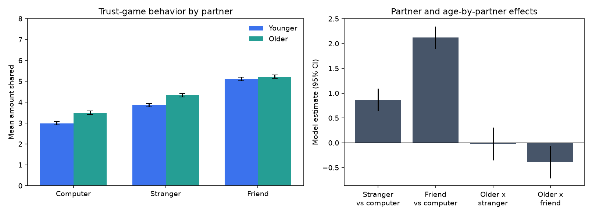

# Hands-on: Social Reward and Trust Across Adulthood

**A short tutorial for lifespan social neuroscience.** You will ask whether
younger and older adults respond differently to social partners in economic
games: friends, strangers, and computer partners. The tutorial starts with a
runnable teaching demo, then shows how to apply the same workflow to the
OpenNeuro social reward dataset, including one optional first-level fMRI GLM.

> **Time:** ~2 hours for the behavioral workflow; ~3-4 hours if you download
> imaging data and run the GLM. **Coding level:** beginner/intermediate Python.

---

## What you'll learn

1. How to frame aging as a social-neuroscience question rather than only a
   cognitive-decline question.
2. How to quantify a **partner effect** in trust-game behavior: friend,
   stranger, and computer.
3. How to test an age-group-by-partner interaction with a transparent linear
   model.
4. How BIDS events become regressors in a first-level fMRI GLM.
5. How to build one social contrast: **friend > stranger** during trust
   decisions.

Runnable code is in [`code/`](code/):

| File | What it does | Needs |
| --- | --- | --- |
| [`code/social_reward_trust.py`](code/social_reward_trust.py) | Simulated teaching demo, real-event summaries, and optional first-level GLM | numpy, pandas, scipy, matplotlib; + nilearn for GLM |

---

## Dataset

The main dataset is
[Social Reward Processing & Decision Making Across the Lifespan](../../data/datasets/social-reward-decision-making.json)
([OpenNeuro ds005123](https://openneuro.org/datasets/ds005123)).
It includes 114 adults ages 21-80 completing social and nonsocial reward tasks
in the scanner. The trust task is especially tutorial-friendly because partner
type is explicit: **friend**, **stranger**, and **computer**.

For broader aging context, compare it with
[HCP-Aging / AABC](../../data/datasets/hcp-aging-aabc.json), a large registered-
access lifespan connectome resource for healthy brain aging.

---

## Setup

From the repository root:

```bash
python3 -m venv venv && source venv/bin/activate
pip install -r tutorials/social-reward-aging/requirements.txt
```

Part 1 runs with no downloads.

```bash
python tutorials/social-reward-aging/code/social_reward_trust.py
```

Expected output:

```text
Simulated trust-game demo (50 participants, 3 partner types)
Mean amount shared by group and partner:
...
Saved .../results/social_reward_trust_demo.png
```



The demo is simulated on purpose: it lets you understand the model and plot
before waiting for a neuroimaging download. The real-data workflow below uses
the same column-normalization and model code when OpenNeuro files are present.

---

## Part 1 - Behavioral question

The trust task asks participants to make decisions involving different partners.
A social reward question can be stated compactly:

> Do people share or invest more with friends than with strangers or computers,
> and does that partner effect differ between younger and older adults?

In the teaching demo, each participant has repeated trials for three partners.
We fit a linear model:

```text
amount_shared ~ age_group + partner + age_group:partner
```

The interaction terms are the lifespan-social-neuroscience part. They test
whether the social context effect differs between age groups.

---

## Part 2 - Real OpenNeuro events

Download the dataset or a subset from OpenNeuro. Event files are small, while
raw multi-echo imaging files are much larger.

```bash
pip install openneuro-py
python3 -m openneuro download --dataset ds005123 --target-dir ds005123
```

For a small local smoke test, you can download only metadata, two event files,
and one raw trust-task BOLD run:

```bash
python3 -m openneuro download --dataset ds005123 --target-dir ds005123 \
  --include CHANGES --include README \
  --include dataset_description.json --include participants.tsv --include participants.json \
  --include 'sub-10317/func/sub-10317_task-trust_run-1_events.*' \
  --include 'sub-10369/func/sub-10369_task-trust_run-1_events.*' \
  --include 'sub-10369/func/sub-10369_task-trust_run-1_echo-1_part-mag_bold.*'
```

Then run the real-event summary:

```bash
SOCIAL_REWARD_DIR=ds005123 python tutorials/social-reward-aging/code/social_reward_trust.py --real
```

The script searches for trust-task `events.tsv` files, infers partner labels from
columns such as `partner`, `condition`, or `trial_type`, and looks for a numeric
choice/investment column such as `trust_value`. BIDS event files differ across
studies, so if the script cannot infer the relevant columns it prints the
discovered columns and you can map them explicitly in the code.

---

## Part 3 - One first-level GLM

The GLM asks where one participant's brain response is stronger for trust
decisions involving a friend than a stranger.

```bash
SOCIAL_REWARD_DIR=ds005123 python tutorials/social-reward-aging/code/social_reward_trust.py --glm --subject sub-10369
```

The script:

1. Finds a trust-task event file and either a preprocessed BOLD run or a raw
   single-echo magnitude BOLD run.
2. Converts partner labels into BIDS `trial_type` regressors:
   `friend`, `stranger`, and `computer`.
3. Fits a first-level GLM with nilearn.
4. Saves a `friend_minus_stranger` z-map and PNG figure.

The contrast is deliberately simple:

```text
friend - stranger
```

For a real paper, you would preprocess the raw multi-echo data carefully, repeat
this across all usable runs and participants, then run a second-level model
testing group and age effects. Here the goal is to show how social task
structure enters a reproducible neuroimaging model.

---

## Caveats

- Age-group differences in social reward are subtle and task-dependent. Treat
  the teaching demo as a scaffold, not a scientific result.
- A single-subject GLM is a tutorial artifact. Do not interpret it as evidence
  for age effects.
- Registered-access aging resources such as HCP-Aging/AABC are excellent for
  lifespan neuroscience, but they are less directly social than this economic-
  games dataset.

---

## Where to go next

- Add subject-level random effects or mixed models.
- Replace `amount_shared` with reaction time, acceptance, or model-derived
  utility if those columns are available in the real events.
- Run the `friend > stranger` GLM for all subjects, then compare younger and
  older groups at the second level.
- Pair this with social-network aging data such as NSHAP for a behavioral
  tutorial on social connectedness and health.

---

*Part of [Social Neuroscience DataFinder](../../). Found an error or have an
improvement? Contributions welcome.*
